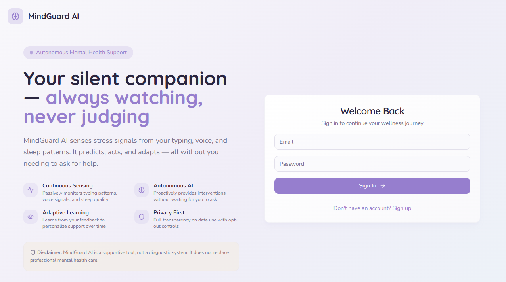
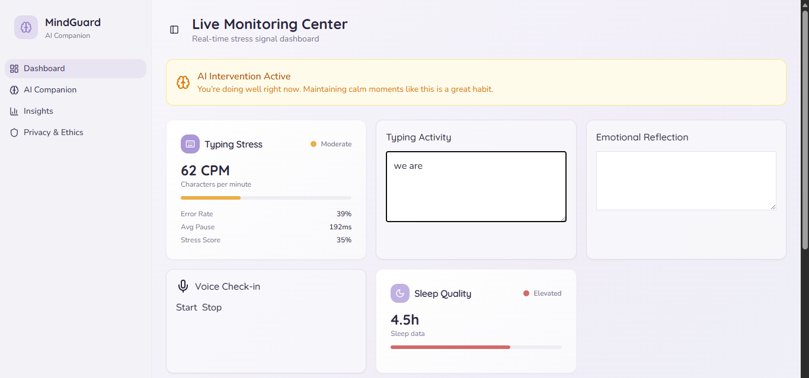
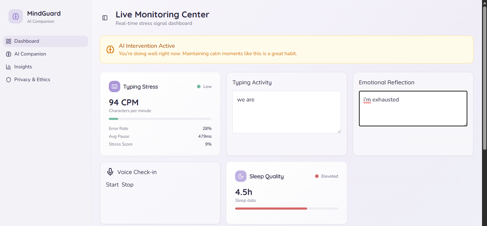
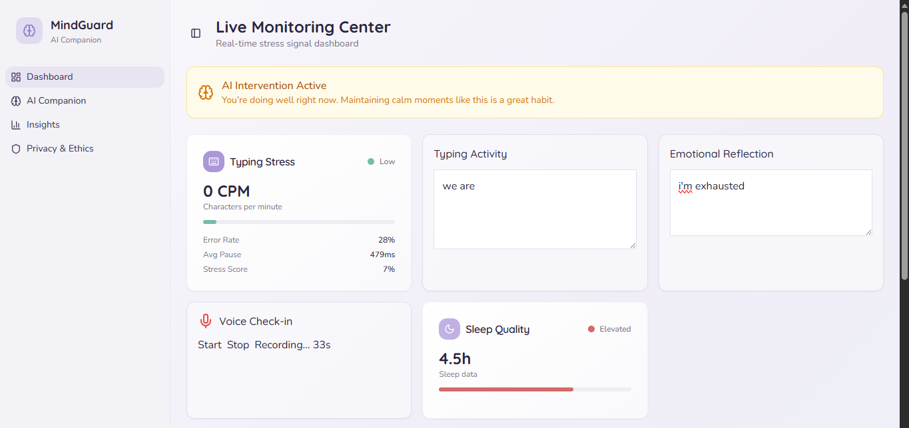
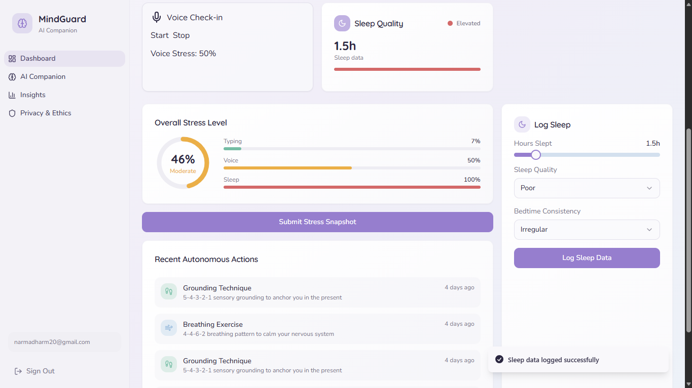
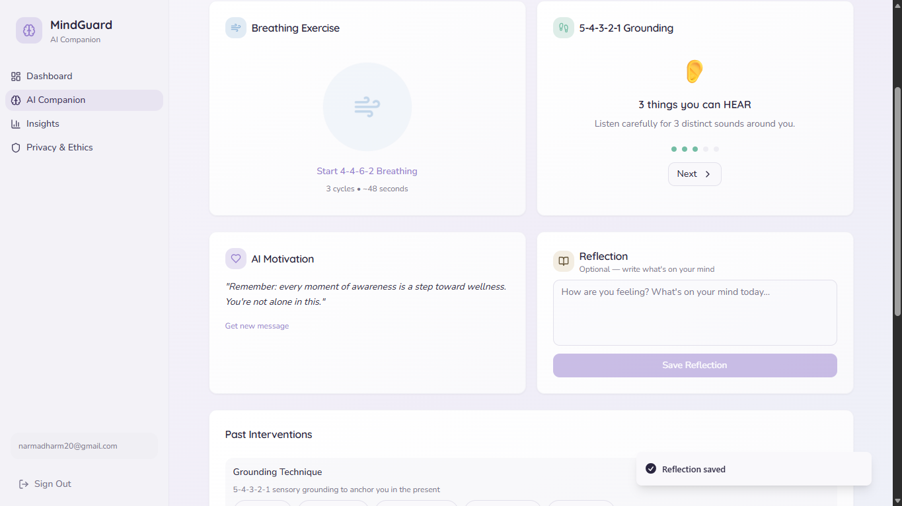
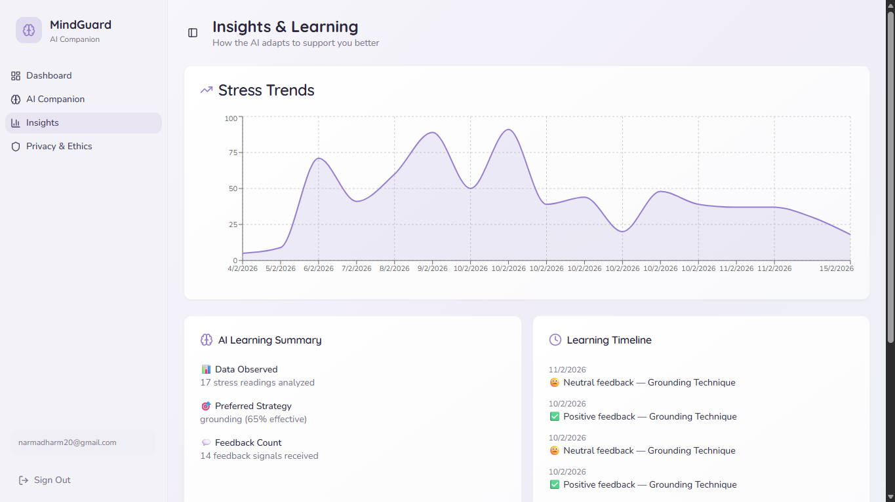
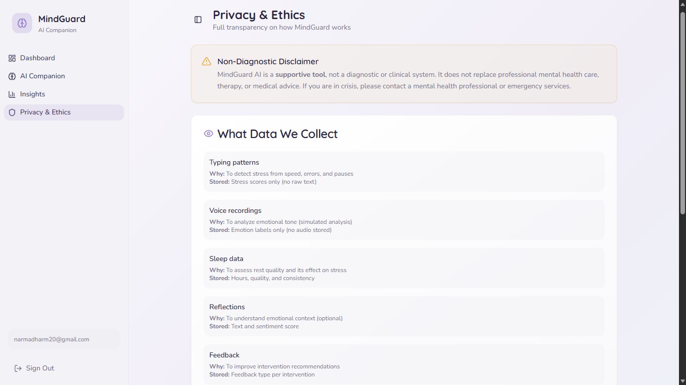

# MindGuard – Agentic AI Mental Health Companion

MindGuard is an intelligent, adaptive AI system that monitors multi-modal stress signals and delivers personalized interventions using Emotion AI, Reinforcement Learning, and a memory-enabled agent framework.

This project was developed as an academic prototype for stress monitoring and adaptive mental health support.

---

## 1. Problem Statement

Students frequently experience stress due to academic pressure, workload, and emotional factors. However:

- Stress is multi-modal (behavioral, physiological, emotional).
- Existing applications are passive and static.
- Most systems do not adapt or learn from user feedback.
- Personalization is limited.

MindGuard addresses this gap by building an agentic AI system that:

- Observes user behavior  
- Predicts stress levels  
- Decides appropriate interventions  
- Acts autonomously  
- Learns from feedback over time  

---

## 2. System Architecture

User Interaction  
→ Emotion Signal Collection (Typing / Voice / Text / Sleep)  
→ Stress Prediction Engine  
→ Agent Decision Engine  
→ Intervention Delivery  
→ User Feedback  
→ Reinforcement Learning Update  
→ Memory Storage (Database)

The system is modular, explainable, and independently evaluatable at each stage.

---

## 3. Application Screenshots

Below are key interfaces demonstrating MindGuard’s architecture, monitoring system, and adaptive AI behavior.

---

### 🔹 3.1 Landing Page – AI Companion Introduction



**Description:**  
The entry interface introducing MindGuard as an autonomous mental health AI companion.  

Highlights:
- Continuous sensing capability
- Privacy-first design
- Adaptive learning framework
- Secure authentication system

---

### 🔹 3.2 Live Monitoring Dashboard



**Description:**  
Real-time stress monitoring center displaying:

- Typing stress metrics (CPM, error rate, pause time)
- Voice emotion proxy
- Sleep quality indicators
- AI intervention activation alerts

Acts as the observation layer of the agentic system.

---

### 🔹 3.3 Typing Stress Analysis Module



**Description:**  
Behavioral Emotion AI component capturing:

- Typing speed
- Correction rate
- Pause intervals
- Computed stress score

Implements real-time behavioral analytics without external APIs.

---

### 🔹 3.4 Overall Stress Fusion Engine



**Description:**  
Weighted multi-modal stress fusion combining:

- Typing (35%)
- Sleep (25%)
- Voice (25%)
- Chat sentiment (15%)

Provides transparent and explainable AI scoring.

---

### 🔹 3.5 Sleep Logging Interface



**Description:**  
Manual sleep data entry interface collecting:

- Hours slept
- Sleep quality
- Bedtime consistency

Integrated into long-term stress modeling.

---

### 🔹 3.6 AI Companion – Intervention System



**Description:**  
Autonomous intervention module delivering:

- Breathing exercises
- 5-4-3-2-1 grounding technique
- Motivational AI messages
- Reflection prompts

Demonstrates reinforcement learning–based decision-making.

---

### 🔹 3.7 Insights & Learning Dashboard



**Description:**  
Visualization of:

- Stress trends over time
- Strategy effectiveness analysis
- Reinforcement learning updates
- Memory-based adaptation timeline

Shows continuous agent learning behavior.

---

### 🔹 3.8 Privacy & Ethics Transparency Page



**Description:**  
Clear explanation of:

- Data collection policies
- Storage mechanisms
- Non-diagnostic disclaimer
- Ethical AI usage principles

Ensures responsible AI deployment.

---

## 4. Core Modules

### 4.1 Typing Behavior Module (Behavioral Emotion AI)

File: `useTypingStress.ts`

Captures:
- Typing speed (CPM)
- Error rate
- Pause patterns

Implements lightweight browser-based behavioral analytics.

---

### 4.2 Voice Emotion Module

File: `useVoiceStress.ts`

Captures:
- Speaking duration
- Energy proxy
- Amplitude variation

Built using MediaRecorder and Web Audio API.

---

### 4.3 Chat Sentiment Module

File: `computeChatStress.ts`

- Rule-based sentiment scoring
- Stress estimation from text polarity
- Offline safe emotional analysis

---

### 4.4 Sleep Context Module

File: `SleepEntryForm.tsx`

Captures:
- Hours slept
- Sleep quality
- Bedtime consistency

Provides long-term physiological context.

---

## 5. Stress Fusion Engine

Overall Stress Score:

```

Overall Stress =
35% Typing +
25% Sleep +
25% Voice +
15% Chat

```

Explainable weighted multi-modal fusion model.

---

## 6. Agentic AI Core

Files:
- `agent.ts`
- `AgentContext.tsx`

Agent Loop:

1. Observe stress score
2. Decide intervention
3. Deliver strategy
4. Collect feedback
5. Update reinforcement model

Interventions include:
- Breathing exercises
- Grounding techniques
- Motivational messages
- Focus sessions
- Reflection prompts

---

## 7. Reinforcement Learning

Files:
- `rlPolicy.ts`
- `applyFeedback()`

Reward Model:
- Helpful → +1
- Neutral → 0
- Not helpful → -1

Implements contextual bandit learning.

---

## 8. Memory-Enabled Agent Framework

Stored in Supabase:

- `stress_readings`
- `sleep_entries`
- `interventions`
- `feedback`
- `strategy_scores`
- `reflections`

Enables long-term personalization.

---

## 9. Backend Infrastructure – Supabase

Used for:

- Authentication
- PostgreSQL database
- Row Level Security
- Real-time updates
- Secure storage

---

## 10. Insights & Visualization

Dashboard features:

- Stress trend graphs
- Strategy effectiveness metrics
- Learning timeline
- Agent memory summary

Demonstrates adaptation and continuous improvement.

---

## 11. Technologies Used

Frontend:
- React
- TypeScript
- Vite
- TailwindCSS
- ShadCN UI
- Lucide Icons

State Management:
- React Hooks
- Context API
- TanStack React Query

Backend:
- Supabase
- PostgreSQL

AI Components:
- Behavioral Emotion AI
- Audio Emotion Heuristics
- Text Sentiment Analysis
- Reinforcement Learning (Contextual Bandit)
- Memory Agent Framework

---

## 12. Setup Instructions

Install dependencies:

```

npm install

```

Configure environment variables:

```

VITE_SUPABASE_URL=your_project_url
VITE_SUPABASE_PUBLISHABLE_KEY=your_anon_key

```

Run development server:

```

npm run dev

```

---

## 13. Disclaimer

This project is an academic prototype and is not intended to provide medical, psychological, or therapeutic advice.

---

## Authors

Developed as part of an academic AI systems project focused on adaptive mental health monitoring.


